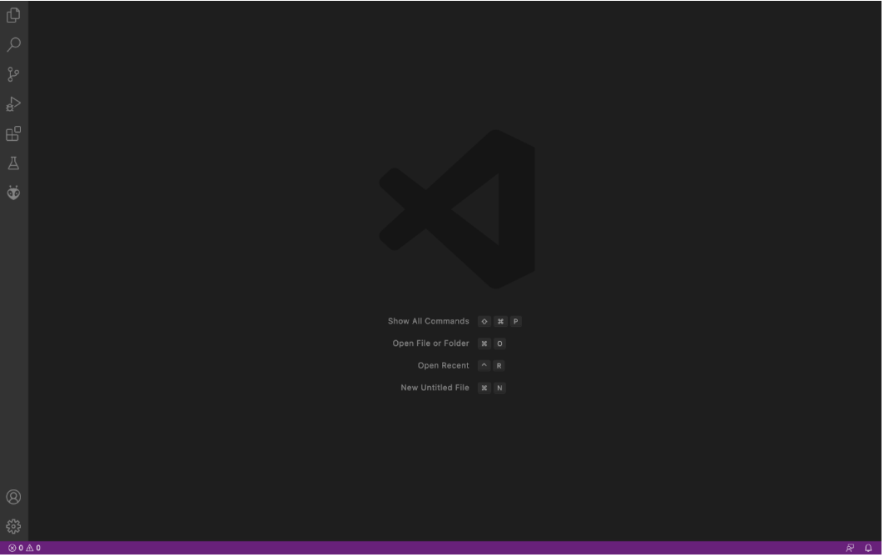

# Lab Report 2 - Servers and Bugs

## PART 1: Creating a Web Server (StringServer)
We need to create a web server called "StringServer" that keeps track of a single string that gets added to by incoming requests.

## Step 2: Remotely Connecting
