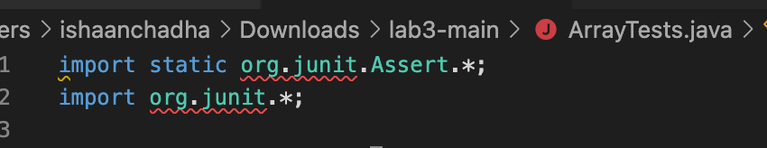
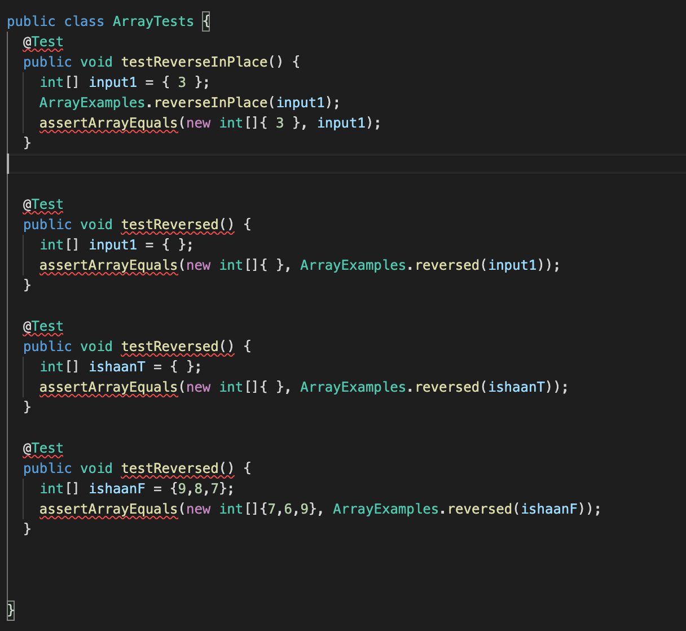

# Lab Report 2 - Servers and Bugs

## PART 1: Creating a Web Server (StringServer)
We need to create a web server called "StringServer" that keeps track of a single string that gets added to by incoming requests.

The code for StringServer.java is given below:

```
import java.io.IOException;
import java.net.URI;

class Handler implements URLHandler {
    String str = "";

    public String handleRequest(URI url) {
        if (url.getPath().equals("/")) {
            if (str.isEmpty()){
                return "String empty: No message added yet.";
            }
            else{ return str;
            }
        }
        if (url.getPath().contains("/add-message")) {
            String[] parameters = url.getQuery().split("=");
            if (parameters[0].equals("s")) {
                str+=parameters[1]+"\n"; return str;
            }
        }
        return "404 Not Found!";
    }
}

class StringServer {
    public static void main(String[] args) throws IOException {
        if(args.length == 0){
            System.out.println("Missing port number! Try any number between 1024 to 49151");
            return;
        }
        int port = Integer.parseInt(args[0]);
        Server.start(port, new Handler());
    }
}
```

The effect of this code is to concatenate a new line (\n) and the string after '=' to the running string, and then respond with the entire string so far.
We can run this code by entering:
* `javac Server.java StringServer.java`
* `java StringServer 4000`

* When the code compiles and runs, we will be able to see `Server Started! Visit http://localhost:4000 to visit.` on our terminal.
* The page displayed after running this should look like:


* The reason for displaying this message is that the "handleRequest" method was invoked. It verifies the initial condition, which further examines the nested condition to determine if the string "str" is devoid of any content. As a result of the string "str" being empty, the message "String is empty. No message added yet." was shown.

* Now we can use the "/add-message" query to add text to our webpage. The webpage would look like:


* In the above image, when we succeed the url with “/add-message?s=Hello”,the server displays "Hello".

* In the image, we can observe that when we append "/add-message?s=Hello" to the URL, the server responds by displaying the word "Hello". This occurs because when we enter the mentioned URL, it triggers the execution of the "handleRequest" method with the URL as the parameter. The method follows a sequence of conditions to determine the appropriate response.

* Firstly, it checks if the URL contains the string "/add-message". If this condition is true, it proceeds to create an array called "parameters" by splitting the string using the regular expression "=".

* Next, it verifies if the first element of the array is "s". If this condition is met, it appends the string to a variable called "str" (which was initially empty) and returns the resulting string. However, if any of the conditions are false, the server will display a "404 Not Found" message.

* Next, when we add “Hi”, it displays "Hello" and "Hi" in different lines.


* Subsequently, when we add "Hi" to the URL, it displays both "Hello" and "Hi" on separate lines. This behavior occurs because when we added "Hello" to the "str" variable, it also included a new line character. Consequently, when we add "Hi", it is displayed in the subsequent line.

## PART 2: Bugs

I chose the `ArrayExamples.java` file for this part.

```
public class ArrayExamples {

  // Changes the input array to be in reversed order
  static void reverseInPlace(int[] arr) {
    for(int i = 0; i < arr.length; i += 1) {
      arr[i] = arr[arr.length - i - 1];
    }
  }

  // Returns a *new* array with all the elements of the input array in reversed
  // order
  static int[] reversed(int[] arr) {
    int[] newArray = new int[arr.length];
    for(int i = 0; i < arr.length; i += 1) {
      arr[i] = newArray[arr.length - i - 1];
    }
    return arr;
  }

  // Averages the numbers in the array (takes the mean), but leaves out the
  // lowest number when calculating. Returns 0 if there are no elements or just
  // 1 element in the array
  static double averageWithoutLowest(double[] arr) {
    if(arr.length < 2) { return 0.0; }
    double lowest = arr[0];
    for(double num: arr) {
      if(num < lowest) { lowest = num; }
    }
    double sum = 0;
    for(double num: arr) {
      if(num != lowest) { sum += num; }
    }
    return sum / (arr.length - 1);
  }


}
```

The given file "ArrayExamples.java" had the following test file:

```
import static org.junit.Assert.*;
import org.junit.*;

public class ArrayTests {
	@Test 
	public void testReverseInPlace() {
    int[] input1 = { 3 };
    ArrayExamples.reverseInPlace(input1);
    assertArrayEquals(new int[]{ 3 }, input1);
	}

  @Test
  public void testReversed() {
    int[] input1 = { };
    assertArrayEquals(new int[]{ }, ArrayExamples.reversed(input1));
  }
  
  @Test
  public void testMyReversed() {
    int[] input1 = {1,2,3};
    assertArrayEquals(new int[]{3,2,1}, ArrayExamples.reversed(input1));
  }
}
```

* The last test failed because the input provided did not pass the test successfully. We will examine the Reverse method and identify the bugs present in it.

* Specifically, in the testMyReversed scenario, the input list is {1, 2, 3}, and the expected output after reversing it should be {3, 2, 1}. However, the actual output shows 0 at index [0] instead of 3.

* This issue might be occurring because there is a bug in the code that changes the given array rather than chaning the new array that we have to return. Also, it then returns the array that was given to us rather than the new reversed array.

Symptom:



* Furthermore, we can observe an input that does not lead to a failure, even if the code is incorrect. This particular input consists of an empty list. In this case, the for loop doesn't run and thus, the error in the code is not reflected.

Symptom:



To fix this bug we need to change the method a bit

```
static int[] reversed(int[] arr) {
    int[] newArray = new int[arr.length];
    for(int i = 0; i < arr.length; i += 1) {
      newArray[arr.length - i - 1] = arr[i];
    }
    return newArray;
  }
```

The following modifications were implemented to address the bugs:

1. The range of the variable "i" was adjusted from "i < arr.length" to "i < arr.length/2". This change ensures that the loop only iterates over the first half of the array.

2. A new temporary variable named "temp" was introduced with the line "int temp = arr[i];". This variable serves the purpose of temporarily storing an element from the first half of the array.

3. A new line "arr[arr.length-i-1] = temp;" was added. This line allows us to assign elements to two different indexes within the array in a single iteration. It facilitates the process of storing the first half in the temporary variable and simultaneously copying the second half to the first half. Finally, the temporary variable is copied back to the second half of the list.

By implementing these changes, the bugs were addressed, and all the tests are expected to pass successfully.


## PART 3: What I Learned

* During Week 2, I gained more knowledge on establishing and operating my personal server using a URL. I found the concepts of ports and local host within the URL quite captivating. Additionally, it was fascinating to observe that when we connected our devices to the remote computer, we could witness each other's updates made to our individual servers, appearing on our respective computers.

* During Week 3, I learned about how bugs in the program can lead to failure in getting our desired output from the code.

