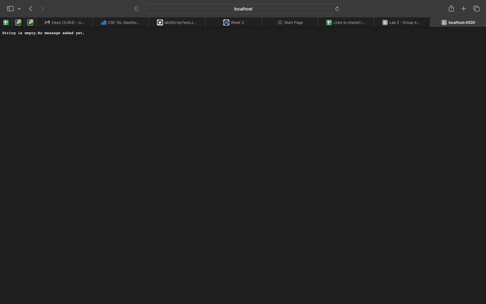
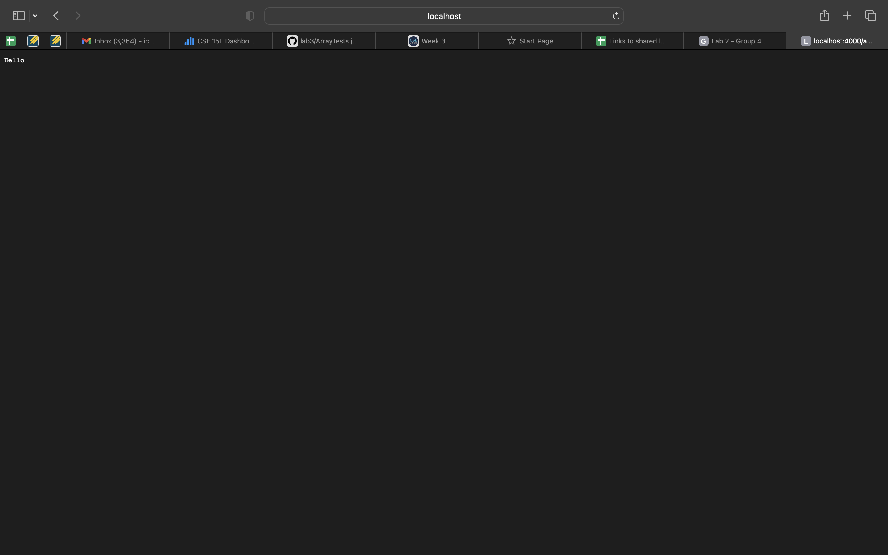
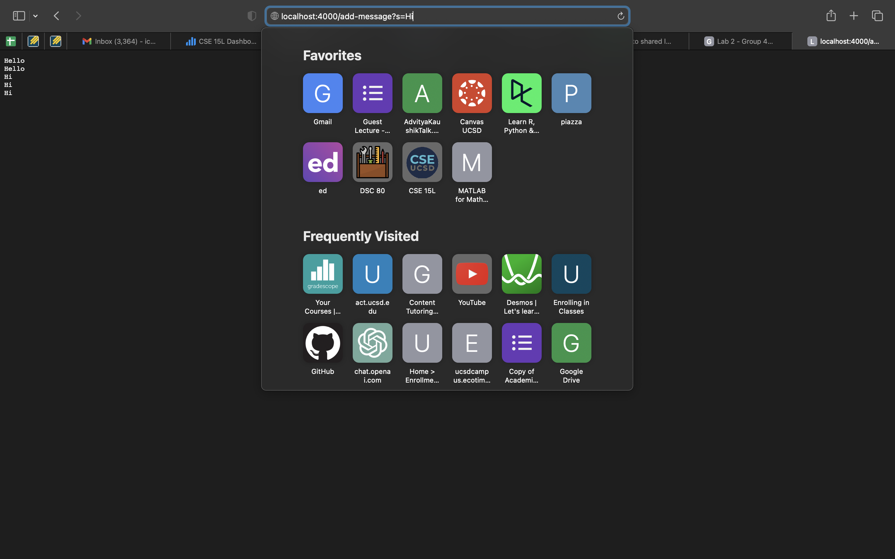

# Lab Report 2 - Servers and Bugs

## PART 1: Creating a Web Server (StringServer)
We need to create a web server called "StringServer" that keeps track of a single string that gets added to by incoming requests.

The code for StringServer.java is given below:

```
import java.io.IOException;
import java.net.URI;

class Handler implements URLHandler {
    String str = "";

    public String handleRequest(URI url) {
        if (url.getPath().equals("/")) {
            if (str.isEmpty()){
                return "String empty: No message added yet.";
            }
            else{ return str;
            }
        }
        if (url.getPath().contains("/add-message")) {
            String[] parameters = url.getQuery().split("=");
            if (parameters[0].equals("s")) {
                str+=parameters[1]+"\n"; return str;
            }
        }
        return "404 Not Found!";
    }
}

class StringServer {
    public static void main(String[] args) throws IOException {
        if(args.length == 0){
            System.out.println("Missing port number! Try any number between 1024 to 49151");
            return;
        }
        int port = Integer.parseInt(args[0]);
        Server.start(port, new Handler());
    }
}
```

The effect of this code is to concatenate a new line (\n) and the string after '=' to the running string, and then respond with the entire string so far.
We can run this code by entering:
* `javac Server.java StringServer.java`
* `java StringServer 4000`

* When the code compiles and runs, we will be able to see `Server Started! Visit http://localhost:4000 to visit.` on our terminal.
* The page displayed after running this should look like:



Now we can use the "/add-message" to add text to our webpage. The webpage would look like:



In the above image, when we succeed the url with “/add-message?s=Hello”,the server displays "Hello".

* Next, when we add “Hi”, it displays "Hello" and "Hi" in different lines.



## PART 2: Bugs

I chose the `ArrayExamples.java` file for this part.

```
public class ArrayExamples {

  // Changes the input array to be in reversed order
  static void reverseInPlace(int[] arr) {
    for(int i = 0; i < arr.length; i += 1) {
      arr[i] = arr[arr.length - i - 1];
    }
  }

  // Returns a *new* array with all the elements of the input array in reversed
  // order
  static int[] reversed(int[] arr) {
    int[] newArray = new int[arr.length];
    for(int i = 0; i < arr.length; i += 1) {
      arr[i] = newArray[arr.length - i - 1];
    }
    return arr;
  }

  // Averages the numbers in the array (takes the mean), but leaves out the
  // lowest number when calculating. Returns 0 if there are no elements or just
  // 1 element in the array
  static double averageWithoutLowest(double[] arr) {
    if(arr.length < 2) { return 0.0; }
    double lowest = arr[0];
    for(double num: arr) {
      if(num < lowest) { lowest = num; }
    }
    double sum = 0;
    for(double num: arr) {
      if(num != lowest) { sum += num; }
    }
    return sum / (arr.length - 1);
  }


}
```

The given file "ArrayExamples.java" had the following test file:

```
import static org.junit.Assert.*;
import org.junit.*;

public class ArrayTests {
	@Test 
	public void testReverseInPlace() {
    int[] input1 = { 3 };
    ArrayExamples.reverseInPlace(input1);
    assertArrayEquals(new int[]{ 3 }, input1);
	}


  @Test
  public void testReversed() {
    int[] input1 = { };
    assertArrayEquals(new int[]{ }, ArrayExamples.reversed(input1));
  }
}
```

* The last test had a failure-inducing input because it didn’t pass the test.

## PART 3: What I Learned

* During Week 2, I gained more knowledge on establishing and operating my personal server using a URL. I found the concepts of ports and local host within the URL quite captivating. Additionally, it was fascinating to observe that when we connected our devices to the remote computer, we could witness each other's updates made to our individual servers, appearing on our respective computers.

* During Week 3, I learned about how bugs in the program can lead to failure in getting our desired output from the code.

