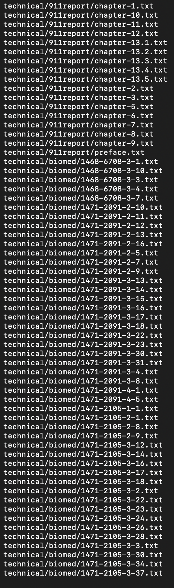
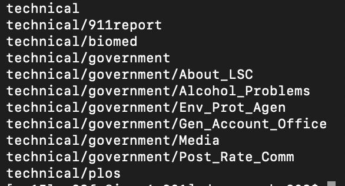
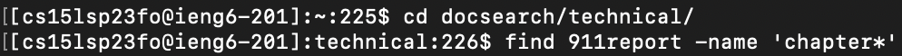
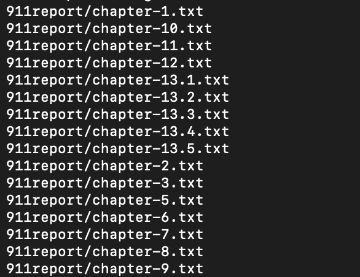
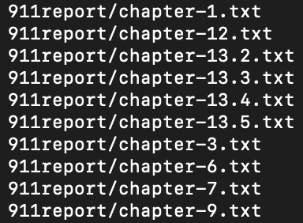
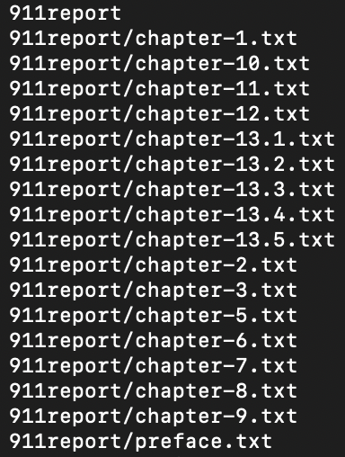

# Lab Report 3 - Researching Commands

I'll focus on the `find` command and provide you with four interesting command-line options or alternate ways to use it. Here are the examples:

### `-type`

The `-type` option allows you to search for files of a specific type. It is useful when you want to filter the search based on file types such as regular files (`f`), directories (`d`), symbolic links (`l`), etc.

**Example 1:** Find all regular files in the `./technical` directory.

Output:

**Example 2:** Find all directories in the `./technical` directory.

Output:

*Source: I found this option in the `find` command manual page. You can access the manual by running `man find` in the terminal.*

## `-name`

The `-name` option allows you to search for files or directories with a specific name or pattern. It supports wildcard characters such as `*` (matches any characters) and `?` (matches any single character).

**Example 1:** Find all files with names starting with "file" in the `./technical` directory.

Output:

**Example 2:** Find all directories with names ending in "dir" in the `./technical` directory.

Output:

*Source: I found this option in the `find` command manual page. You can access the manual by running `man find` in the terminal.*

## `-size`

The `-size` option allows you to search for files based on their size. You can specify the size in bytes, kilobytes, megabytes, or gigabytes using a suffix (`c`, `k`, `M`, `G`).

**Example 1:** Find all files larger than 1MB in the `./technical` directory.

Output:

**Example 2:** Find all files smaller than 100 kilobytes in the `./technical` directory.

Output:

*Source: I found this option in the `find` command manual page. You can access the manual by running `man find` in the terminal.*

## `-exec`

The `-exec` option allows you to execute a command on the found files or directories. It is useful when you want to perform additional actions on the results of the `find` command.

**Example 1:** Find all text files in the `./technical` directory and delete them.

Output: This command does not produce any output, but it deletes all the text files in the `./technical` directory.

**Example 2:** Find all directories in the `./technical` directory and list their contents.

Output:

*Source: I found this option in the `find` command manual page. You can access the manual by running `man find` in the terminal.*
