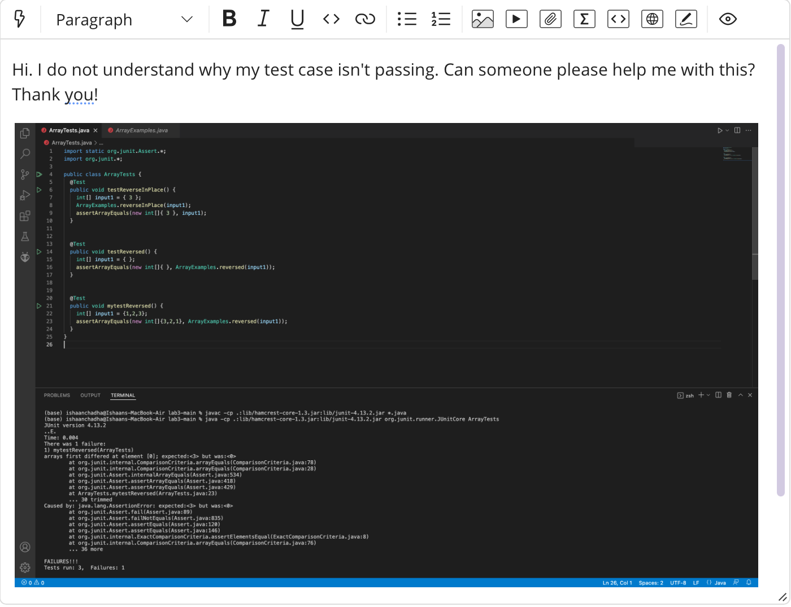
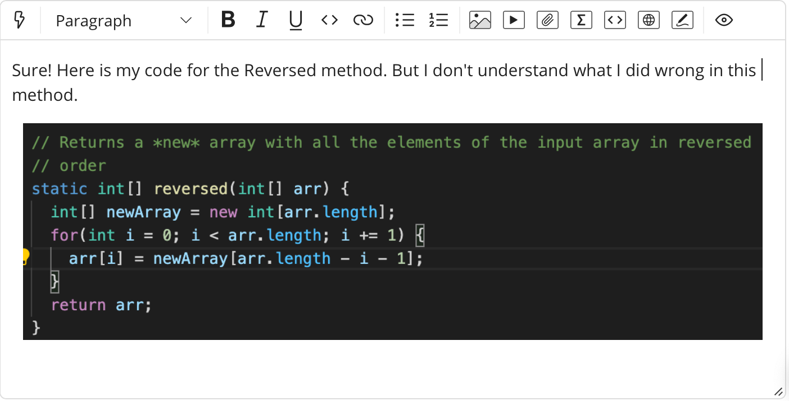

# Part 1 – Debugging Scenario

* **Student's Response:** The image below displays the original post from a student with a screenshot showing a symptom and a description of a guess at the bug/some sense of what the failure-inducing input is.

* **TA's Response:** "Hi there! Thanks for reaching out. The error message seems to indicate an issue with the "Reversed" method of the "ArrayExamples" class. Can you further share what your code for the "Reversed" method looks like?

* **Student's Response:** The image below displays the response from the student with a screenshot showing the "Reversed" method of the "ArrayExamples" class.

* **TA's Response:** "Hi there! Thanks for reaching out. The error message seems to indicate an issue with the "Reversed" method of the "ArrayExamples" class. Can you further share what your code for the "Reversed" method looks like?
