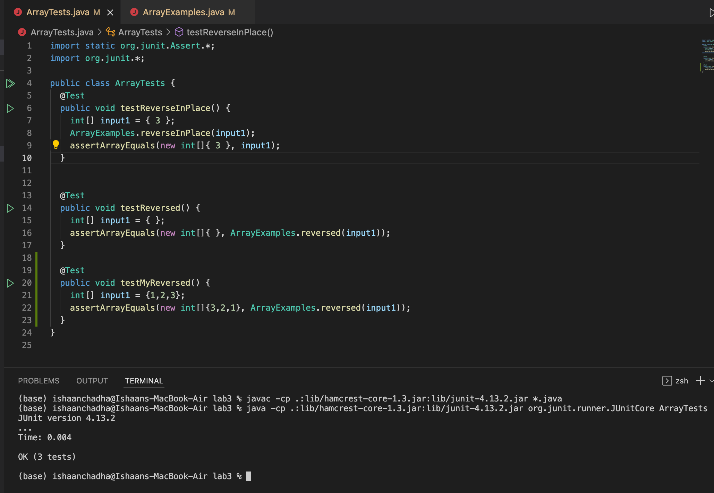

# Part 1 – Debugging Scenario

* **Student's Response:** The image below displays the original post from a student with a screenshot showing a symptom and a description of a guess at the bug/some sense of what the failure-inducing input is.


* **TA's Response:** "Hi there! Thanks for reaching out. The error message seems to indicate an issue with the "Reversed" method of the "ArrayExamples" class. Can you further share what your code for the "Reversed" method looks like?

* **Student's Response:** The image below displays the response from the student with a screenshot showing the "Reversed" method of the "ArrayExamples" class.


* **TA's Response:** "Hi again! Thanks for reaching out. This issue might be occurring because there is a bug in the code that changes the given array rather than changing the new array that we have to return. Also, it then returns the array that was given to us rather than the new reversed array.

To fix this bug we need to change the method a bit:

```
static int[] reversed(int[] arr) {
    int[] newArray = new int[arr.length];
    for(int i = 0; i < arr.length; i += 1) {
      newArray[arr.length - i - 1] = arr[i];
    }
    return newArray;
  }
```

The following modifications were implemented to address the bugs:

1. The line with "arr[i] = newArray[arr.length -i -1]" was flipped around to "newArray[arr.length - i - 1] = arr[i]" because in java, the left hand side is the side that gets modified. And here, rather than modifying the original array, we change the array that we need to return.

2. Rather than return arr, which is the original array that was given to us, we return newArray, which is the modifed reversed array.

By implementing these changes, the bugs were addressed, and all the tests are expected to pass successfully.



